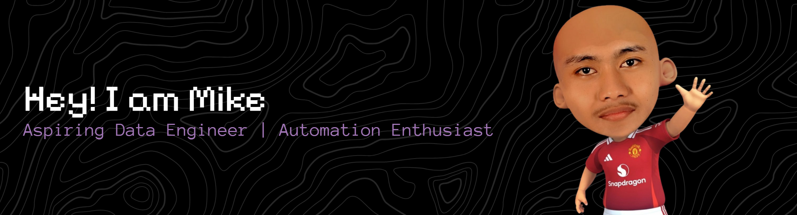

### *Welcome to my GitHub profile! I'm an aspiring Data Engineer and automation enthusiast, currently learning and building projects with modern technologies.*

---

## Technologies & Tools

**AI & Development Assistants**

**Development Environment & Languages**

---

## GitHub Statistics

<picture>
  <source
    srcset="https://github-readme-stats.vercel.app/api?username=mfikribp&show_icons=true&theme=omni"
    media="(prefers-color-scheme: omni)"
  />
  <source
    srcset="https://github-readme-stats.vercel.app/api?username=mfikribp&show_icons=true&theme=omni"
    media="(prefers-color-scheme: light), (prefers-color-scheme: no-preference)"
  />
  
</picture>

<picture>
  <source
    srcset="https://github-readme-stats.vercel.app/api/top-langs/?username=mfikribp&layout=compact&theme=omni"
    media="(prefers-color-scheme: omni)"
  />
  <source
    srcset="https://github-readme-stats.vercel.app/api/top-langs/?username=mfikribp&layout=compact&theme=omni"
    media="(prefers-color-scheme: light), (prefers-color-scheme: no-preference)"
  />
  
</picture>

---

## Connect With Me

*jangan diseriusin bang, saya masih nub

